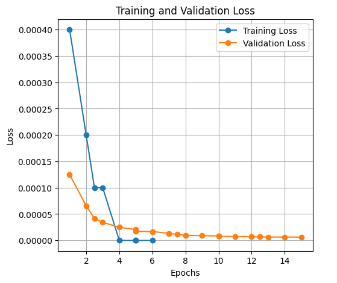

[Watch Demo Video](https://github.com/oceangiri23/Smart_form_filler/blob/main/demovideo.mp4)

# Nepali Document Information Extraction

This project aims to extract vital data from Nepali documents in a structured format. It uses different image preprocessing steps with OpenCV, passes the processed images to an OCR model (Tesseract/PaddleOCR), and then applies a fine-tuned BERT Named Entity Recognition (NER) model. The BERT model is fine-tuned on manually labeled data generated from the OCR output, extracting 13 tags from sentences and providing the results in JSON format.

## Workflow
1. **Image Preprocessing**:
   - Uses OpenCV to enhance document images before passing them to OCR.

2. **OCR Processing**:
   - Two options: [Tesseract OCR](https://github.com/tesseract-ocr/tesseract) / [PaddleOCR](https://github.com/PaddlePaddle/PaddleOCR)
   - Extracts text from the preprocessed document image.

3. **NER Extraction**:
   - Uses a fine-tuned BERT model trained on the output from OCR.
   - The model extracts 13 specific tags from the text and outputs them in a structured JSON format.

## Requirements
The required packages are listed in `requirements.txt`. Install them using:
```bash
pip install -r requirements.txt
```

## Fine-tuning Curve
Below is the training and validation curve for the fine-tuned BERT model:

  
(Replace `path_to_your_image.png` with the actual image path)

## Model Weights
Link to the saved_model weight of fine-tuned BERT NER:  
[Download Model Weights](https://drive.google.com/drive/folders/1GXaBFuES1Mr96DWTT5PoVp3hPh5zoGVt?usp=sharing)

Create a folder `model` inside `OCR_NER` and place the weights there. The structure should be like:
```
model--
       |V1--
             |saved_model
             |tokenizer_saved_model
```

## Output Format
The extracted information is outputted as a JSON file with 13 specific tags, such as:
```
{
'citizenship_num': '37-02-77-00000',
'first_name': 'John',
'last_name': 'bashyal',
'gender': 'male',
'Birth_year': '2003',
'Birth_month': 'jun',
'Birth_day': '06',
'Birth_district': 'rupandehi',
'Birth_ward': 'bamgha',
'Birth_wardno': '8',
'Permanent_dist': 'Rupandehi',
'Permanent_ward': 'tilottama',
'Permanent_wardno': '1'
}
```

## For passport document 
For passport processing, we utilized the Machine Readable Zone (MRZ) located at the bottom of the document. The Nepali passport follows the TD3 format, which consists of two lines, each containing 44 characters. The first line includes the surname and given names, while the second line contains the passport number, nationality, date of birth, expiration date, and citizenship number.

The MRZ section is cropped from the document image and passed through an OCR model for text extraction. Subsequently, regular expressions are applied to the OCR output to accurately extract and structure the information in a proper format.
```
{
'first_name': 'DIPU',
 'last_name': 'CHAULAGAIN',
 'passport_no': '12066201',
 'DOB': '2088-04-03',
 'gender': 'MALE',
 'expire_date': '2031-01-19',
'cit_no': '2118200'
}
```


